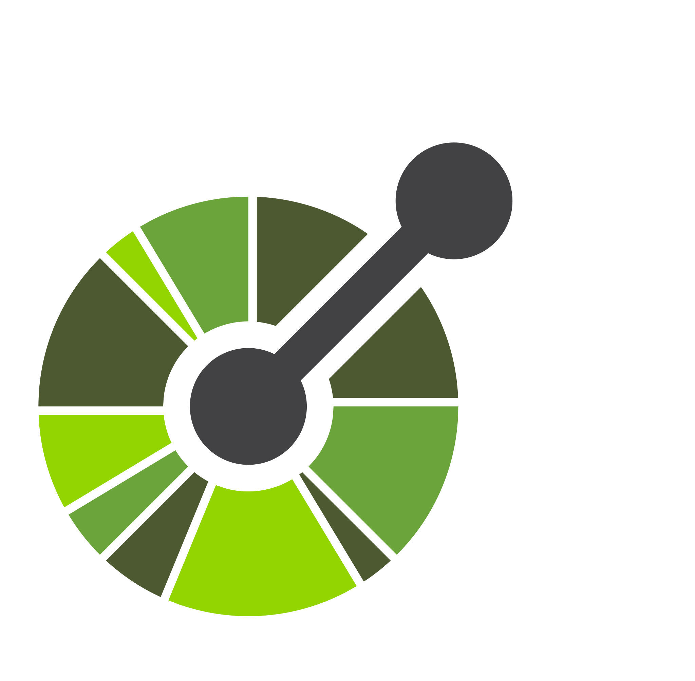

<!-- 🏄‍♂️ **Faizolam/Faizolam** is a ✨ _special_ ✨ repository because its `README.md` (this file) appears on your GitHub profile. -->
## <picture></picture> ***Hi there***

<picture> </picture>

***🏄‍♂️ Faiz Alam***
 

<i>I'm a passionate Software Engineer dedicated to building efficient, scalable, and robust software solutions. With a strong foundation in backend development and additional experience in frontend, I thrive as a full-stack developer, creating seamless, end-to-end applications that deliver meaningful value to clients.

I also bring extensive experience in cloud infrastructure, with Google Cloud Platform (GCP), Amazon Web Services(AWS) and Terraform for infrastructure as code. My focus includes building automated CI/CD pipelines that streamline workflows for reliable, consistent, and efficient deployments. Leveraging serverless architecture, I aim to create solutions that are both cost-effective and highly scalable.</i>

<!-- 🛠 My Toolkit:

### 🔙 Backend Engineering:

 

### 🎨 Frontend Development:

☁️ Cloud & DevOps:

🔄 Automation & CI/CD:

🗄️ Database Management: -->

### 🧰 Languages and Tools

<!--  -->
<!--  -->
<!--  -->
<!--  -->
<!--  -->

<!--  -->

 

#

<!--  -->

 

#
 
 

### <b> Let's Connect..!</b>

<!-- ### <b> Github Stats </b>

<a href="https://github.com/Faizolam/">
   
   
  
</a>

 -->

<!-- ### 📊 GitHub Stats:
 

 

  -->

<!-- ### 🏆 GitHub Trophies
 -->

<!--  -->

<!-- Here are some ideas to get you started:

- 🔭 I’m currently working on ...
- 🌱 I’m currently learning ...
- 👯 I’m looking to collaborate on ...
- 🤔 I’m looking for help with ...
- 💬 Ask me about ...
- 📫 How to reach me: ...
- 😄 Pronouns: ...
- ⚡ Fun fact: ... -->

